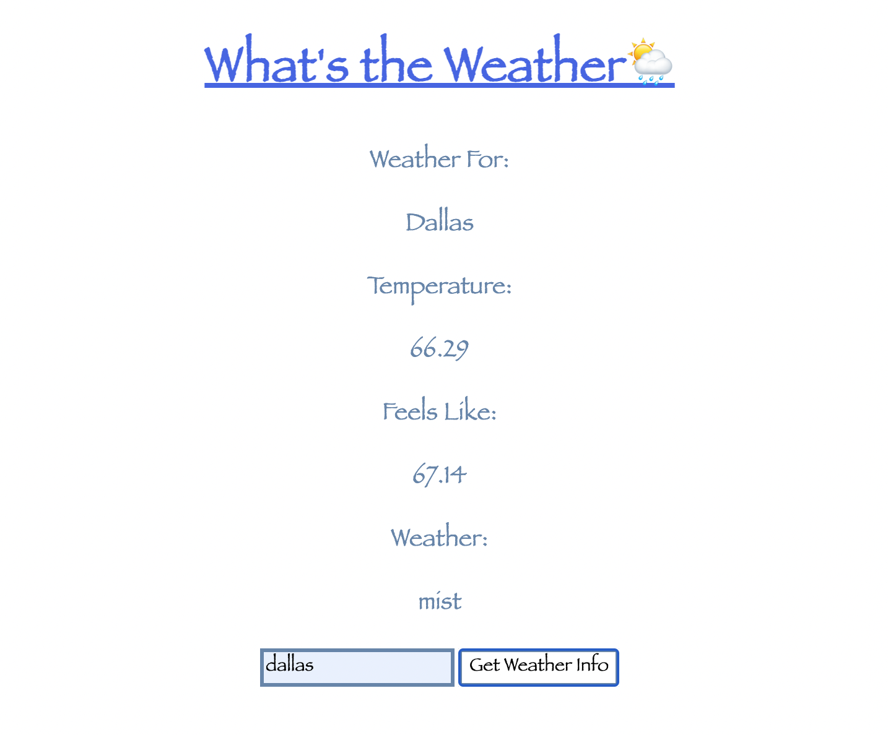
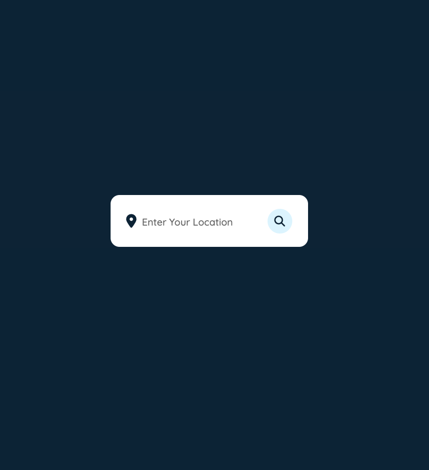
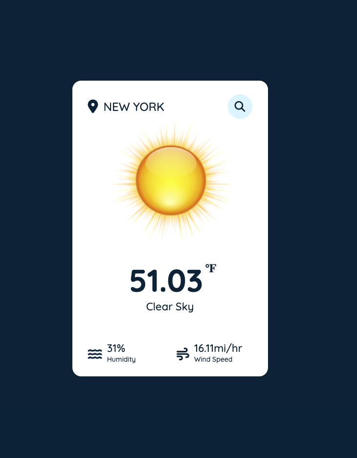
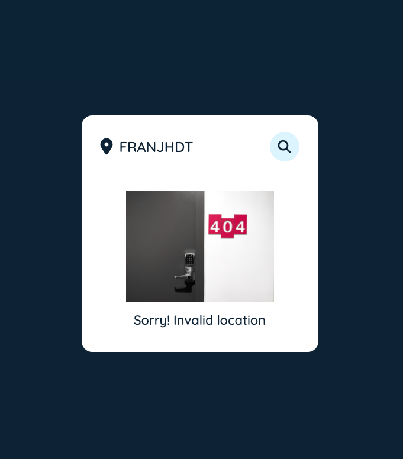

# What's the Weather 🌦

a simple app for checking the weather

## Technologies 
- HTML
- CSS
- JavaScript
- [Open Weather Map API](https://openweathermap.org/current)

## User Story
- As a user I want to be able to check the current weather at anytime and at any location since I am always on the go

## Screenshots
### Wireframe

### Working app - - Old version

### Working app - - New

## Getting started
[click here](https://sherryjsph3.github.io/whats-the-weather/) to see working app

## Future Goals
- The ability to get hourly, 5 day and 10 day forcast
